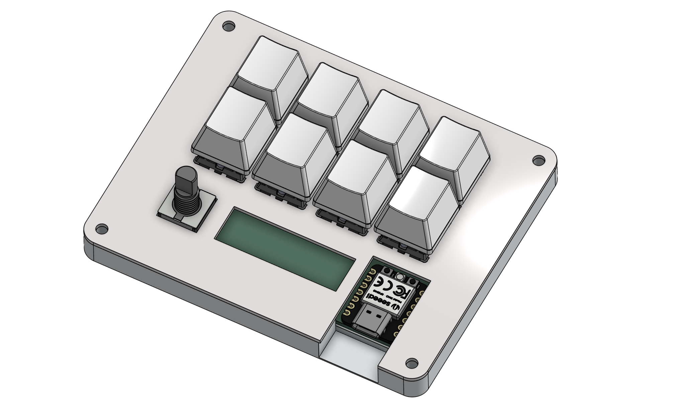
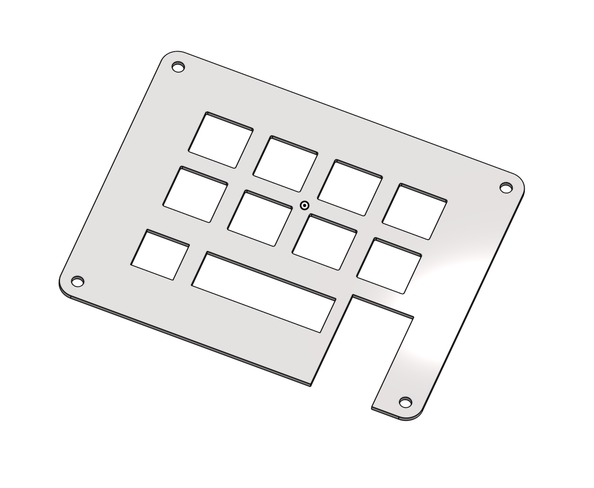
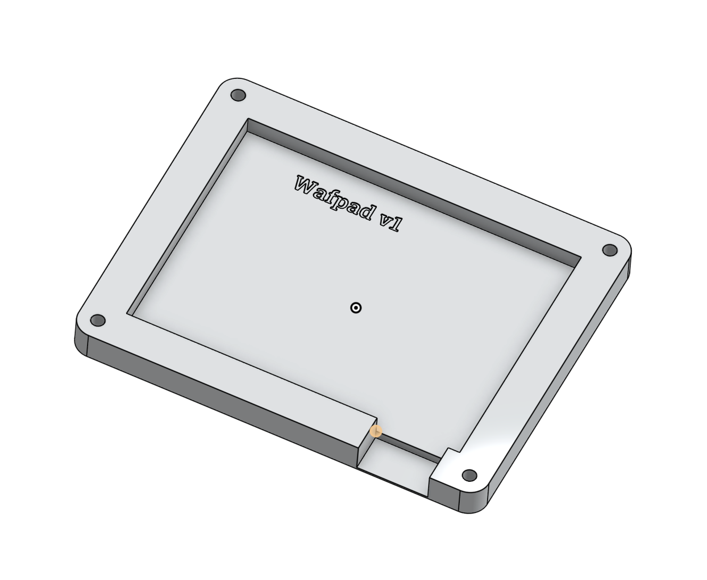
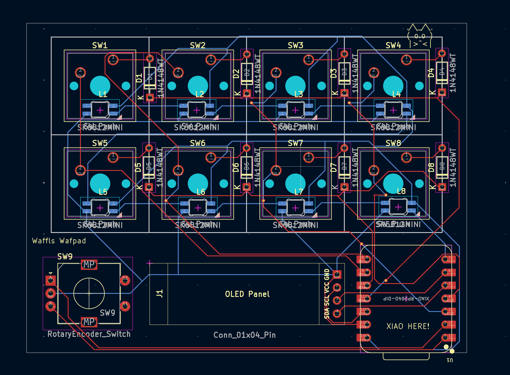
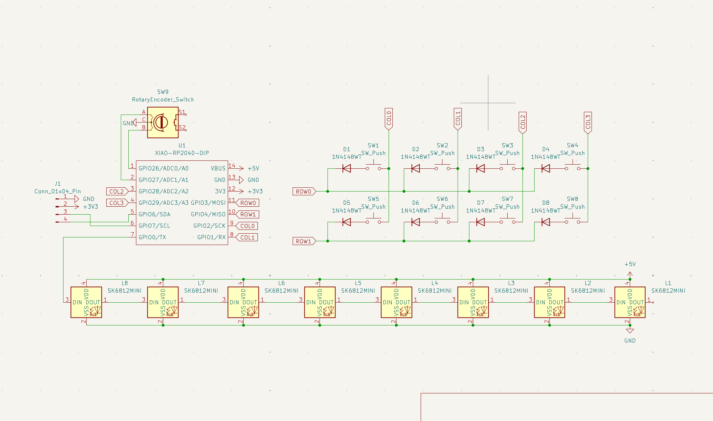

# Wafpad
A lil macropad with some screens and stuff

Green area at the bottom is for the .91" OLED display I just couldent find a 3d model for it

# Inspiration
Mainly inspired by the stream deck neo but without the angled case (Will be added to CAD in the future)

# Case CAD
Top and bottom CAD files for case 

Designed in onshape

# PCB and Schematic
I used Kicad to design both the PCB and Schematic

I used a 2x8 matrix to get all of the keys to fit as I diddnt have enough gpio ports

# BOM
Everything to make a Wafpad!
- 1x XIAO RP2040 (with headers)
- 1x EC11 Rotary Encoder
- 1x 0.91" OLED Display
- 8x Cherry MX Switches
- 8x Blank DSA Keycaps
- 8x Diode (THT)
- 8x SK6812 Mini LEDs

Case

- 4x M3x16mm screws
- 4x M3x5mx4mm heatset inserts
- 1x Wafpad case v1.step
- 1x Wafpad top v1.step

# Firmware
Currently havent made it because im not sure how to without having the pcb to use kmk, so I currently have the example doc from the hackpad tutorial but I will update this after I make and program it
